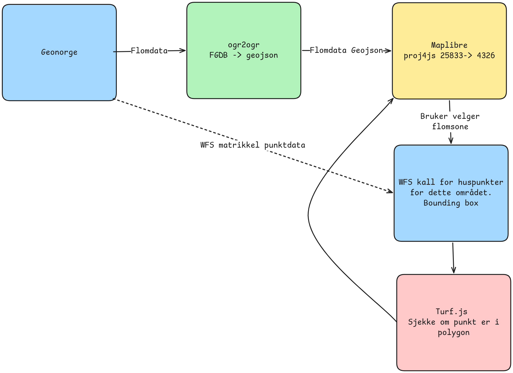
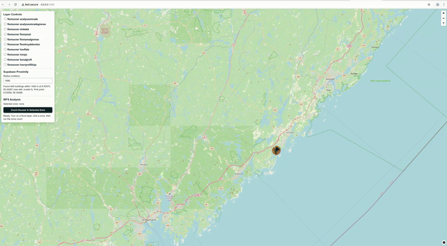

# IS-218-Gruppe5
IS-218 gruppeinnlevering

# Prosjektnavn 
Bufferzonen
# TLDR;
Raskt identifisere hvor flomsoner befinner seg og gjennomføre en analyse av hvor mange bygninger som er registrert innenfor en gitt flomsone.

# Datakatalog
| Datasett | Kilde | Format | Bearbeiding |
|---|---|---|---|
| Matrikkel bygningspunkt | GeoNorge WFS (Kartverket) | WFS (GML/XML i respons) | Hentes direkte ved behov via WFS-spørring (bbox rundt valgt flomsone), parses i klient og brukes i punkt-i-polygon-analyse |
| Flomsoner (Agder) | GeoNorge nedlastingstjeneste | FGDB (nedlastet), deretter GeoJSON | Lastet ned som FGDB, konvertert/reprojisert til GeoJSON (EPSG:4326) for visning og analyse i MapLibre |

# Teknisk stack
- MapLibre GL JS `4.7.1`
- Proj4js `2.11.0`
- Turf.js `6.5.0`
- HTML5 / CSS3 / JavaScript (ES6)
- GDAL/OGR (for dataforbehandling: FGDB -> GeoJSON)




# Refleksjon
- Parsing av XML/GML fra WFS-spørringen i nettleseren er praktisk, men en backend-løsning (proxy) ville vært bedre for ytelse og stabilitet.
- Kan legge til funksjonalitet for å sjekke flere områder samtidig.
- Punkt-i-polygon i nettleseren fungerer bra for moderate datamengder, men kan bli tregt ved svært store WFS-kall.
- Kan forbedre brukervennligheten.

# Oppgave 2
## Beskrivelse av utvidelsen
Webkartet er utvidet med en dynamisk romlig analyse mot Supabase/PostGIS:
- Brukeren klikker i kartet, og applikasjonen sender klikk-koordinater (`lng`, `lat`) og valgt radius (meter) til en SQL-funksjon i Supabase.
- SQL-funksjonen bruker `ST_DWithin` for å finne bygninger innenfor valgt avstand fra klikkpunktet.
- Resultatet returneres som punkter med avstand (`ST_Distance`) og visualiseres direkte i kartet.
- Grensesnittet gir visuell feedback med:
  - markør i klikkpunktet
  - radiussirkel
  - uthevede treffpunkter
  - statusmelding med antall funn
## Demo av system
Demo av Oppgave 2-flyten (klikk -> SQL -> visualisering):

## SQL-snippet (Supabase/PostGIS)
```sql
create or replace function buildings_within_distance(
  clicked_lng double precision,
  clicked_lat double precision,
  radius_m integer default 250
)
returns table (
  bygningid bigint,
  bygningstype bigint,
  objtype text,
  lon double precision,
  lat double precision,
  distance_m double precision
)
language sql
stable
as $$
  with clicked as (
    select ST_SetSRID(ST_MakePoint(clicked_lng, clicked_lat), 4326)::geography as g
  )
  select
    b.bygningid,
    b.bygningstype,
    b.objtype,
    ST_X(b.geom::geometry) as lon,
    ST_Y(b.geom::geometry) as lat,
    ST_Distance(b.geom, c.g) as distance_m
  from public.actuall_buildings b
  cross join clicked c
  where b.geom is not null
    and ST_DWithin(b.geom, c.g, radius_m)
  order by distance_m asc;
$$;
```

## Link til notebook
[Åpne notebook (Oppgave 2)](./2a/is218a.ipynb)